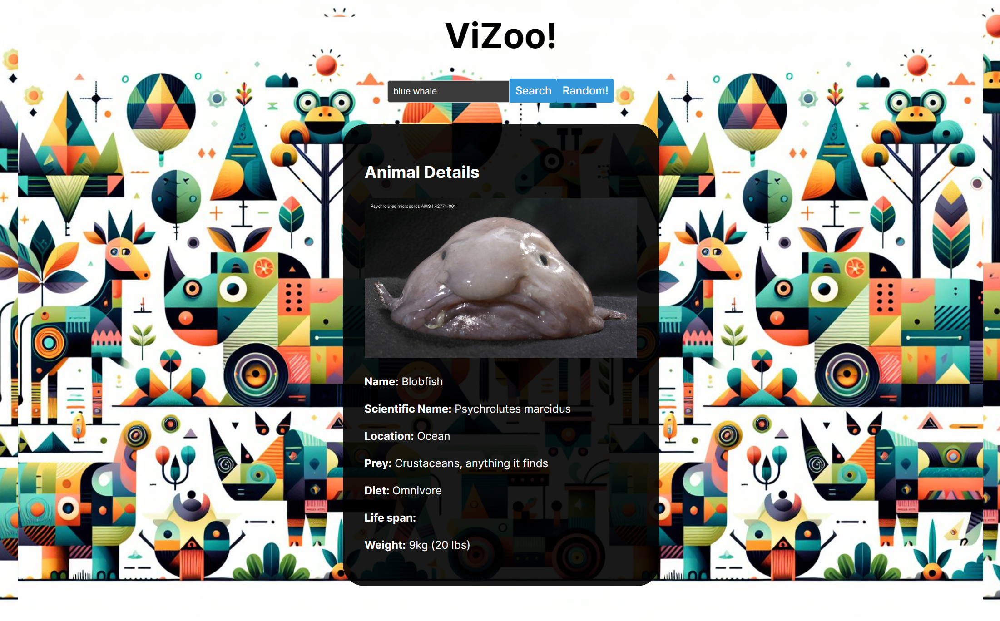
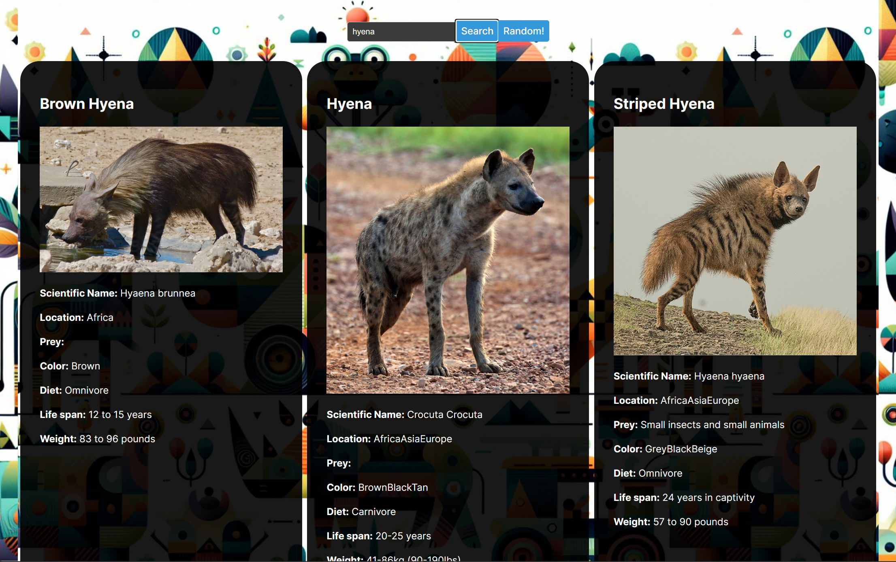

# ViZoo by Tien Pham

A website to learn about the animal kingdom, made with Rust and React.

## How to run ViZoo:

1. Download the files in this repository.
2. Install Rust and Node.js if you haven't.
3. Navigate to the backend directory
4. Build the project: `cargo build`
5. Run the backend: `cargo run`
6. Navigate to the frontend directory
7. Run the frontend: `npm run dev`
8. Click on the link in your terminal to open the website in your browser.

## MVP: 
- A website that lets you look up and learn about an animal, with an option to randomly generate one.

## License

[LICENSE](LICENSE.md)

## Project Summary
ViZoo provides a simple interface to learn about the animal world. Users can look up any species to learn more about their habitat, diets, locations, and other fun information. The backend is built entirely in Rust. I used [axum](https://crates.io/crates/axum) as the framework for my web server after being introduced to it in the Full Stack class. For the front end, I decided to go with the [React](https://react.dev/) framework to cut down on development time. Other essential crates for backend development in Rust, such as [tokio](https://crates.io/crates/tokio), [reqwest](https://crates.io/crates/reqwest), [serde](https://crates.io/crates/serde) were also used.

I find it challenging but fun to piece together the different pieces and work around their limitations. For example, the external API I use to get animal information does not have a random endpoint, which my project requires. To fix this, I used a CSV file containing a database of thousands of animals from which I picked a random animal to use with the API. Another issue arises if an animal exists in the CSV database, but not in the API database, which requires a loop to check until an animal is found. I also wanted my website to display images of the animals, which the API doesn't provide. But I got it to work by using an [image-search](https://crates.io/crates/image_search) crate. However, due to multiple API calls for each user request, the webserver is not the fastest thing in the world.

Admittedly, more effort could have been spent on code testing on this project. To test that my project, especially the Rust web server, works as intended, I used plugins within the IntelliJ IDE to create HTTP requests with custom data.

## What I could improve
In a potential future version of the website, the results would be more tailored and more specific for each animal. There is a lot of information in the API response body that was unused.

I would also like to spend more time on the data visualization side of the project. Potential elements could be a map of the world for the locations of a species. I'm thinking of using emojis to represent their diet. For each animal, the background could change to an image of their natural habitat. The possibilities are endless!

