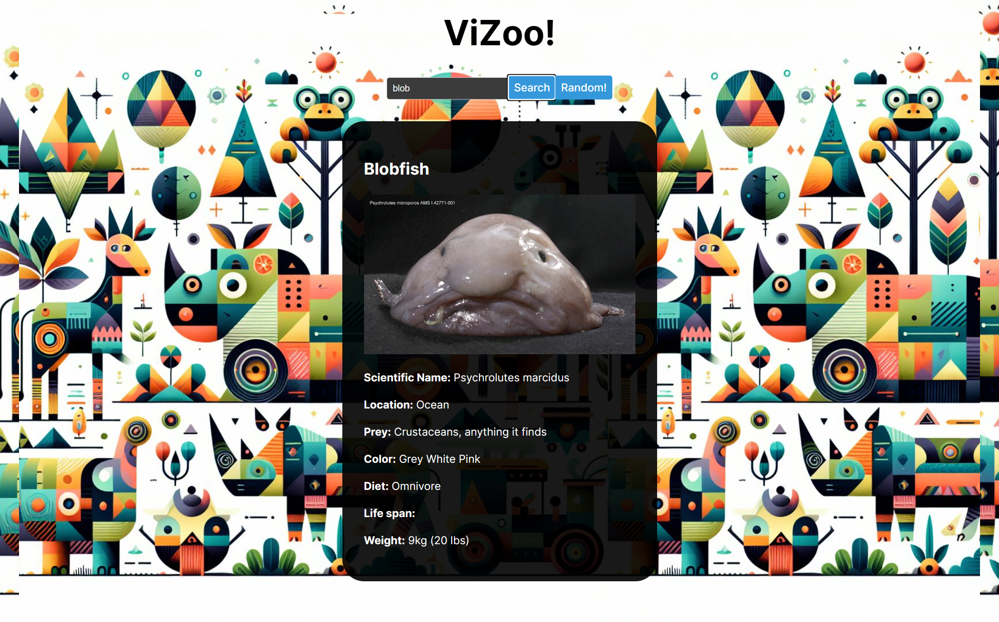

# ViZoo

A website to learn about the animal kingdom, made with Rust and React.

## How to run ViZoo:

1. Download the files in this repository.
2. Install Rust and Node.js if you haven't.
3. Navigate to the backend directory
4. Build the project: `cargo build`
5. Run the backend: `cargo run`
6. Navigate to the frontend directory
7. Run the frontend: `npm run dev`

## MVP: 
- A website that lets you look up and learn about a random animal, or an animal that you choose.

## License

[LICENSE](LICENSE)

## Project Summary
ViZoo provides a simple interface to learn about the animal world. Users can look up any species to learn more about their habitat, diets, locations, and other fun information. The backend is built entirely in Rust. For the front-end, I decided to go with the React framework to cut down on development time. This project was challenging as a beginner in Rust. Aside the usual obstacle in working with Rust compiler, I had to learn about the different Rust crates that my project needed.
I find it challenging but fun to piece together the different pieces, and work around their limitations. For example, the external API I use to get animal information does not have a random end point, which my project requires. To fix this, I used a CSV file containing a database of thousands of animals from which I pick a random animal to use with the API. Another issue arises if an animal exists in the CSV database, but not in the API database, which requires a loop to check until an animal is found. I also wanted my website to display images of the animals, which the API doesn't provide. But I got it to work by using an image-search crate. However, due to multiple API calls each time the user makes a search, the webserver is not the fastest thing in the world. I am happy that it works nonetheless.

